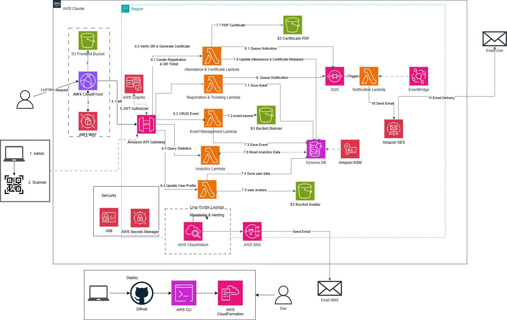

# CLOUD-BASED EVENT MANAGEMENT PLATFORM

## Serverless AWS-Based Platform for Event Management, Ticketing, and Attendance

### 1. Project Summary

The Cloud-Based Event Management Platform is a comprehensive digital solution for organizing and managing events on a cloud computing platform with a Serverless architecture. The project was researched and developed to optimize operating costs, automatically scale according to actual request volume, and target organizations that host technology workshops and seminars for developer and business communities.

The system supports strict role-based permissions by separating roles: Attendee and Admin/Organizer. The platform covers the full lifecycle of an event through four interconnected core subsystems:
- Event Management: Allows immediate public event creation (Active), updates event information, and manages banner images visually.
- Authentication, Registration & Ticketing: Manages user identity (Email/Google OAuth), processes slot availability checks and updates in real time, and automatically closes registration when the event reaches capacity.
- Attendance & Certificate: Supports organizers scanning attendees' QR codes at the venue, automatically generates PDF certificates stored in the cloud, and sends download links by email.
- Monitoring & Analytics: Collects real-time operational data and displays event performance metrics on a dashboard.

The project applies a Serverless Modular Application model in the Singapore region (ap-southeast-1). All cloud infrastructure is managed and deployed automatically as Infrastructure as Code (IaC) using AWS SAM (Serverless Application Model).

---

### 2. Problem Statement

#### What is the problem?
Currently, most small and medium-sized technology clubs and organizations still rely on manual methods or separate office tools (Google Forms, Excel, manual email sending) when organizing workshops, leading to several drawbacks:
- Difficulty controlling actual attendance: Google Forms does not have a mechanism to automatically block registrations in real time when the venue is full, which can cause overbooking and disrupt event logistics.
- Lack of an automatic waiting list mechanism: When an event is overbooked, organizers cannot automatically move late registrants to a waiting list to handle seat releases when tickets are canceled.
- Bottlenecks at check-in: Manual ticket verification by matching Excel lists at the entrance causes delays, confusion, and a poor queue experience for attendees.
- High post-event effort: The process of designing, creating attendance certificates, and sending emails to each developer after the event requires significant human resources and time.
- Wasteful traditional infrastructure: Maintaining virtual servers (EC2) or databases running 24/7 wastes a large amount of budget during long idle periods between events when there is little or no traffic.

#### Solution
The platform provides a unified application that automates all touchpoints in the event management process using fully managed cloud services:
- Real-time ticketing and slot control: Customers register via API, and the system automatically checks available slots using direct conditional expressions in the database layer. If seats are available, the system updates the count and issues an official QR ticket; if not, it immediately blocks the request to prevent overbooking.
- High-speed QR check-in: Organizers use the camera on a web/mobile interface to scan the unique QR code on the attendee's ticket, and the system records check-in status immediately in the database.
- Automated certificate generation (PDF): After the event ends, the system triggers a Lambda function to compile a personalized PDF certificate, upload it to secure Amazon S3 storage, and automatically send an email with the download link to attendees via Amazon SES.
- Automated notifications without manual intervention: The system proactively sends confirmation emails as soon as a ticket is successfully registered and automatically sends reminders before the event, using Amazon EventBridge's asynchronous event orchestration, eliminating the need for organizers to send messages manually.
- Strict layered security: Account management is centralized through Amazon Cognito, and the backend API is protected by an API Gateway with a Cognito JWT Authorizer.

#### Benefits and Value Delivered
- 100% digitalization and automation: Reduces manual organizer workload by up to 90% before, during, and after the event.
- Infinite scalability (Elastic Scalability): Automatically scales resources to handle thousands of simultaneous ticket registrations when the workshop registration opens, without causing system congestion.
- Absolute cost optimization: Thanks to the Serverless pay-as-you-go model, operating costs during periods without events approach $0 USD.
- Enterprise-grade practical experience: The project provides the development team with deep hands-on experience in NoSQL data modeling, infrastructure-as-code development, and testing distributed systems.

---

### 3. Solution Architecture

The system is deployed centrally in the AWS Singapore region (ap-southeast-1).

#### Architecture Diagram and Overall Data Flow

<i>Figure 3.1: Serverless architecture and data interaction flow on AWS.</i>

**Operational flow description:**
The client (React frontend) interacts directly with Amazon Cognito to complete the login flow and receive a JWT token. For business requests, the client attaches this JWT to the header and sends it through Amazon API Gateway. At this point, a global Cognito JWT Authorizer config decodes and validates the token before routing the request to the processing layer.

The business layer consists of separate AWS Lambda functions running on the .NET 8 runtime. The system data is organized using a Multi-Table Design model on Amazon DynamoDB. For large media files (event banners, avatars, certificate PDFs), the system uses Amazon S3 with secure Presigned URLs so clients can upload/download files directly.

For frontend distribution, the system uses Amazon CloudFront as a CDN layer in front of the private S3 frontend bucket (configured with Block Public Access), connected via Origin Access Control (OAC) so that only CloudFront can read objects from the bucket; users cannot access S3 directly. At present, the project uses the default domain provided by CloudFront (`*.cloudfront.net`), and has not yet attached a custom domain or ACM certificate; this is an extension item for the next development phase when the project deploys a dedicated brand domain.

For notifications and automated tasks, the system uses an event-driven model with Amazon EventBridge as the orchestration layer, rather than Amazon SNS or Amazon SQS. Two notification flows are separated clearly:

- Reminder flow: An EventBridge Schedule runs every hour (`rate(1 hour)`) and directly triggers the Lambda Notification function. This function scans the EventManagementEvents and EventManagementTickets tables to identify upcoming events, calls Amazon SES directly to send reminder emails, and records the sending result in EventManagementNotificationLogTable.
- Ticket registration notification flow: Immediately after the Registration & Ticketing Lambda records a successful ticket, it publishes a custom event (`PutEvents`) with source `eventmanagement.ticket` and detail-type `TicketRegistered` to a custom EventBridge event bus. An EventBridge Rule configured to listen for this event pattern asynchronously triggers the same Notification Lambda, which then uses Amazon SES to send registration confirmation emails and write the corresponding logs.

Because of this design, a single Notification Lambda (written in .NET 8/C#) handles both notification use cases, triggered by two independent EventBridge sources without adding an intermediate queue layer.

#### AWS Services Used in the Project
- Amazon Cognito: Manages account registration via Email (with Verification Code authentication) and Google Login (OAuth2) integration, issuing JWT tokens for role-based authorization (Attendee/Admin).
- Amazon API Gateway: HTTP/REST API gateway that receives requests, routes data flows, and enforces security authorizers at the edge layer.
- AWS Lambda (.NET 8): Executes all business logic (CRUD events, reservation registration, waiting-list queue handling, QR check-in validation, certificate PDF generation, and notification/reminder processing via EventBridge).
- Amazon DynamoDB (Multi-Table): NoSQL database that stores distributed information across independent tables: EventManagementEvents, EventManagementCategories, EventManagementTickets, EventManagementUsers, EventManagementAttendance, and EventManagementNotificationLogTable.
- Amazon S3: Securely stores system assets (event banners, user avatars, certificate PDFs, frontend build) with strict Block Public Access policies.
- Amazon SES: Reliable email service used to send account verification codes, registration confirmation emails, reminder emails, and certificate download links.
- Amazon CloudWatch: Central monitoring system that collects execution logs from Lambda and metrics from API Gateway, DynamoDB, and EventBridge for debugging and health tracking.
- AWS SAM / AWS CloudFormation: Tools for defining infrastructure using code, managing, and deploying the full cloud resource stack via template.yaml.
- Amazon CloudFront: Acts as the CDN layer for the React frontend, in front of the private S3 frontend bucket through Origin Access Control (OAC). Currently uses the default domain issued by AWS, without Custom Domain/ACM Certificate integration.
- Amazon EventBridge (Schedule & Custom Event Bus): Acts as the central orchestration layer for the asynchronous notification subsystem, with one Schedule running hourly to send reminder emails and one Rule listening for TicketRegistered events published by the ticket registration Lambda.
- Amazon SNS / SQS: Not used in the current architecture. The entire notification flow is handled directly through Amazon EventBridge combined with direct calls from the Notification Lambda to Amazon SES, without an additional queue or pub/sub intermediary.

---

### 4. Technical Implementation

#### Implementation Stages (From Week 7 to Week 12)
- Phase 1 – Research & Evaluation (Week 7): Review the overall requirements of the event management project and assess the technical feasibility of the AWS Serverless service stack.
- Phase 2 – Analysis & Workflow Design (Week 8): Define the MVP scope and design user flow diagrams for authentication (Email OTP, Google OAuth) and business flows for seat reservation/waiting list.
- Phase 3 – Initialize IaC Infrastructure (Week 9): Configure AWS SAM CLI, write infrastructure configuration files for the Multi-Table DynamoDB deployment, configure the S3 bucket for assets, and set up secure IAM roles.
- Phase 4 – Authentication & API Security Integration (Week 10): Deploy Cognito User Pool, configure email-based Verification Code delivery, and set up the Cognito JWT Authorizer on API Gateway.
- Phase 5 – Develop Business Logic (Week 11): Integrate Google OAuth into Cognito, write .NET 8 code for Lambda functions handling event create/update/delete, generate S3 Presigned URLs for banners/avatars, process ticket slot deduction, implement QR-based check-in logic, configure the EventBridge Schedule for hourly reminders, set up a Custom Event Bus and EventBridge Rule listening for TicketRegistered events to trigger the Notification Lambda asynchronously, deploy the frontend via S3 + CloudFront with Origin Access Control, and integrate SES for both notification flows.
- Phase 6 – End-to-End Testing & Optimization (Week 12): Conduct end-to-end system testing, optimize resource configurations to reduce costs, complete the Workshop Report document, and prepare the graduation demo script.

---

### 5. Timeline & Milestones

| Milestone | Stage / Key Milestone | Actual Deliverables |
| --- | --- | --- |
| Week 7 | Requirements Research & Feasibility Assessment | Requirements analysis document, list of selected AWS services. |
| Week 8 | Architecture Design & User Flow Diagrams | Serverless architecture diagram, user flow diagrams for Auth and Tickets. |
| Week 9 | Infrastructure Setup with AWS SAM | Source code for template.yaml successfully creating Multi-Table DynamoDB, S3, and IAM resources. |
| Week 10 | Authentication & Security Gateway Deployment | Stable Cognito environment, API Gateway with JWT Authorizer enabled. |
| Week 11 | Backend Business Logic Development | Complete source code for Lambda functions handling Events, Ticket Registration, QR Check-in, EventBridge Schedule/Rule for Notification, frontend deployment via CloudFront, and SES integration. |
| Week 12 | End-to-End Testing & Packaging | System running smoothly, complete technical documentation, and final demo script prepared. |

---

### 6. Estimated Operating Cost (Economic Proposal for Demo Scale)

| AWS Service | Assumed Usage | Estimated Cost / Month | Main AWS Policy Note |
| --- | --- | --- | --- |
| Amazon Cognito | 200 MAU (Email & Google Login) | $0.00 | Fully free for the first 50,000 MAU per month. |
| Amazon API Gateway | 20,000 REST API requests | $0.07 | Price in ap-southeast-1 is $3.50 per 1 million requests. |
| AWS Lambda | 40,000 invocations (512MB RAM, average 400ms each) | $0.00 | Entirely within AWS Free Tier limits. |
| Amazon DynamoDB | 6 separate tables (including EventManagementNotificationLogTable), On-Demand mode, 500MB capacity | $0.05 | Storage cost is $0.25/GB. |
| Amazon S3 | 2 GB Standard storage (including frontend build), 5,000 PUT/GET requests | $0.08 | Standard storage cost: $0.025/GB. |
| Amazon SES | 500 emails sent (OTP, registration confirmation, reminders, certificate links) | $0.05 | Price: $0.10 per 1,000 emails sent. |
| Amazon CloudWatch | Collect and ingest 1 GB system logs | $0.50 | Log ingestion price: $0.50/GB in Singapore. |
| Amazon CloudFront | ~2,000 requests, using default domain *.cloudfront.net, no Custom Domain | $0.02 | Mostly within the Free Tier for 1TB data transfer in the first 12 months; estimate covers light overage. |
| Amazon EventBridge (Schedule + Custom Event Bus) | ~720 Schedule runs/month (hourly) + PutEvents count equal to number of ticket registrations | $0.01 | Custom event pricing is $1 per million events published; negligible at demo scale. |
| Data Transfer Out | ~2 GB outbound Internet data | $0.18 | Public Internet outbound data price: $0.09/GB. |

#### Estimated total cost: approximately $0.96 USD/month.

---

### 7. Risk Assessment and Mitigation Measures

#### Technical Risk Matrix
1. Duplicate ticket registration requests when the event is nearly full (Race Condition):
   - Mitigation: Use DynamoDB Conditional Expressions to isolate and serialize slot availability checks before recording the status as CONFIRMED.
2. Malicious users spam-uploading harmful files or gaining write access to the cloud:
   - Mitigation: Enable S3 Block Public Access across the board. All banner or avatar uploads must be authorized through an S3 Presigned URL endpoint with a lifespan under 15 minutes. The frontend bucket is allowed to be read only through CloudFront using Origin Access Control, not publicly.
3. Cost increases due to infinite loops in the code:
   - Mitigation: Set strict Hard Timeout limits for each Lambda function to no more than 10 seconds. Also configure AWS Budgets Alerts to notify if the account cost reaches $5.
4. Overload/throttling when sending bulk emails or timezone mismatch in EventBridge Schedule: The EventBridge Schedule runs at `rate(1 hour)` in UTC, which may cause reminder emails to be sent at the wrong time if the Vietnamese time zone (UTC+7) is not converted correctly. At the same time, if the number of events/tickets is large, direct calls from the Notification Lambda to Amazon SES may hit the account sending rate limit.
   - Mitigation: Normalize all timestamps stored in DynamoDB to UTC and convert them explicitly to Vietnam time in the logic layer when checking whether an event is approaching. Monitor EventBridge Schedule TargetErrorCount and SES Throttle/Bounce metrics through CloudWatch. Limit the number of emails sent per execution and request a sending limit increase for the SES account according to the actual event scale.

---

### 8. Expected Results and Deliverables

#### Project Deliverables
1. Application source code & cloud infrastructure: A stable .NET 8 backend source tree and a complete template.yaml (AWS SAM CLI) infrastructure configuration, including EventBridge Schedule, Custom Event Bus/Rule, and CloudFront Distribution settings.
2. Cloud database: A working structure of 6 DynamoDB Multi-Table databases (including EventManagementNotificationLogTable), with accurate and synchronized data.
3. Technical Documentation (Workshop Report): System analysis document, user flow diagrams, detailed NoSQL table design, Notification/Reminder flow description through EventBridge, and successful end-to-end API integration test scenarios.