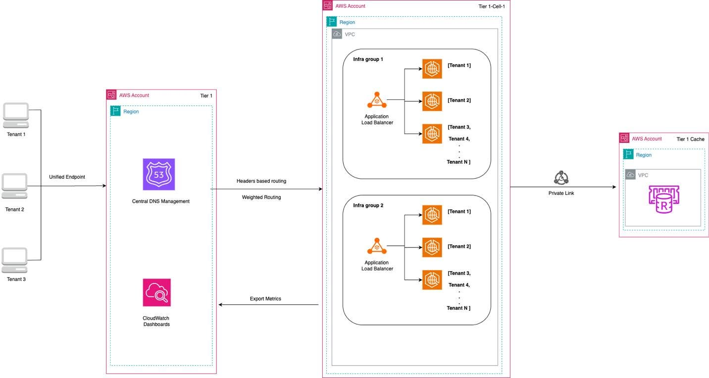

# Building a Hybrid Multi-Tenant SaaS Architecture for Stateful Services on AWS

## Giới thiệu

Trong quá trình phát triển các hệ thống SaaS, việc thiết kế kiến trúc **Multi-Tenant** luôn là một bài toán quan trọng. Đặc biệt với các ứng dụng có trạng thái như **Game Server**, **Chat thời gian thực** hoặc hệ thống cộng tác trực tuyến, kiến trúc cần vừa đảm bảo khả năng mở rộng, vừa duy trì hiệu năng và tính cô lập giữa các khách hàng.

Thông qua bài viết của AWS Architecture Blog, mình tìm hiểu về mô hình **Hybrid Multi-Tenant Architecture**, một giải pháp kết hợp giữa mô hình **Shared / Pool** và **Dedicated / Silo** để tận dụng ưu điểm của cả hai.

## Kiến trúc tổng quan

Kiến trúc được chia thành ba phần chính:

- **Central Routing Layer**
- **Infrastructure Layer**
- **State Management Layer**

Thay vì cố định tất cả khách hàng trên cùng một hạ tầng, hệ thống sẽ định tuyến mỗi **Tenant** đến nhóm tài nguyên phù hợp dựa trên cấu hình đã được thiết lập.

## Luồng hoạt động của hệ thống

### Bước 1. Người dùng gửi yêu cầu

Mỗi Tenant truy cập vào hệ thống thông qua một **Unified Endpoint** duy nhất.

Thông tin Tenant, thường là **Tenant ID**, sẽ được gửi kèm trong Header hoặc Token của mỗi request.

### Bước 2. Định tuyến trung tâm

**Amazon Route 53** chịu trách nhiệm quản lý DNS và đưa request đến cụm hạ tầng phù hợp.

Việc định tuyến có thể dựa trên:

- Header-based Routing
- Weighted Routing
- Chính sách phân phối tải

Đồng thời, **Amazon CloudWatch Dashboard** thu thập Metrics từ toàn bộ hệ thống để giám sát hiệu năng.

### Bước 3. Điều hướng đến Infrastructure Group

Sau khi xác định Tenant thuộc nhóm nào, request sẽ được chuyển đến một **Infrastructure Group**.

Mỗi Infrastructure Group bao gồm:

- Application Load Balancer
- Các Kubernetes Pods trên Amazon EKS
- Nhiều Tenant dùng chung hoặc tách riêng tài nguyên

Ví dụ:

- Tenant nhỏ dùng chung hạ tầng để tiết kiệm chi phí.
- Tenant Enterprise được tách sang nhóm tài nguyên riêng để đảm bảo hiệu năng.

### Bước 4. Đồng bộ trạng thái

Với các ứng dụng Stateful, trạng thái người dùng cần được lưu liên tục.

**Amazon ElastiCache for Redis** được sử dụng để:

- Đồng bộ Session
- Lưu Cache
- Chia sẻ trạng thái giữa các Pod

Nhờ đó, nếu một Pod gặp sự cố, người dùng vẫn có thể tiếp tục làm việc mà không bị mất phiên.

## Mô hình Hybrid Multi-Tenant

Kiến trúc này kết hợp hai mô hình phổ biến là **Pool Model** và **Silo Model**.

### Pool Model

Ưu điểm:

- Tiết kiệm chi phí
- Khai thác tài nguyên hiệu quả
- Phù hợp với khách hàng nhỏ

Nhược điểm:

- Có nguy cơ xảy ra hiện tượng **Noisy Neighbor**
- Hiệu năng giữa các Tenant có thể ảnh hưởng lẫn nhau

### Silo Model

Ưu điểm:

- Mỗi khách hàng có tài nguyên riêng
- Bảo mật và hiệu năng cao
- Phù hợp với doanh nghiệp lớn

Nhược điểm:

- Chi phí triển khai cao
- Khó tối ưu tài nguyên nếu lưu lượng thấp

### Hybrid Model

Hybrid là sự kết hợp của cả hai mô hình trên.

- Tenant nhỏ được gom vào Pool.
- Tenant lớn được tách thành Silo.
- Có thể chuyển đổi giữa hai mô hình mà không cần thay đổi ứng dụng.

Đây là điểm nổi bật nhất của kiến trúc.

## Những dịch vụ AWS được sử dụng

| Dịch vụ | Vai trò |
|---|---|
| Amazon Route 53 | Quản lý DNS và định tuyến Tenant |
| Application Load Balancer | Phân phối request |
| Amazon EKS | Chạy ứng dụng Container |
| Amazon ElastiCache for Redis | Đồng bộ trạng thái và Cache |
| AWS PrivateLink | Kết nối an toàn giữa các VPC |
| Amazon CloudWatch | Theo dõi Metrics và Dashboard |

## Ưu điểm của kiến trúc

- Linh hoạt giữa hiệu năng và chi phí.
- Hỗ trợ mở rộng số lượng Tenant lớn.
- Có thể nâng cấp khách hàng từ Shared sang Dedicated dễ dàng.
- Quản lý tập trung trên cùng một nền tảng.
- Hỗ trợ Stateful Services với độ trễ thấp.

## Đánh giá cá nhân

Theo mình, điểm thú vị nhất của kiến trúc này là **lớp Routing được tách biệt với hạ tầng bên dưới**.

Thay vì cố định một Tenant trên một cụm máy chủ, quyết định điều hướng được quản lý thông qua cấu hình. Điều này giúp doanh nghiệp dễ dàng thay đổi cách phân bổ tài nguyên khi nhu cầu sử dụng thay đổi mà không cần chỉnh sửa nhiều trong ứng dụng.

Bên cạnh đó, việc sử dụng Redis để đồng bộ Session giữa các Pod giúp giảm nguy cơ mất trạng thái khi xảy ra sự cố hoặc khi hệ thống tự động mở rộng.

Tuy nhiên, các Stateful Services vẫn gặp thách thức trong quá trình Auto Scaling. Khi số lượng Pod giảm xuống, hệ thống cần đảm bảo trạng thái của người dùng được di chuyển an toàn sang Pod khác trước khi Pod cũ bị hủy. Nếu xử lý không tốt, người dùng có thể bị mất kết nối hoặc gián đoạn trải nghiệm.

## Kết luận

Hybrid Multi-Tenant Architecture là một giải pháp hiệu quả cho các hệ thống SaaS hiện đại, đặc biệt với những ứng dụng yêu cầu duy trì trạng thái liên tục.

Bằng cách kết hợp mô hình Shared và Dedicated, doanh nghiệp vừa tối ưu chi phí vận hành vừa đảm bảo hiệu năng cho các khách hàng quan trọng.

Qua bài viết này, mình hiểu rõ hơn cách AWS thiết kế một kiến trúc có khả năng mở rộng linh hoạt. Đồng thời, mình cũng nhận thấy tầm quan trọng của việc tách riêng lớp định tuyến khỏi hạ tầng triển khai để hệ thống dễ dàng thích ứng với sự phát triển trong tương lai.

## Tài liệu tham khảo

AWS Architecture Blog. *Building a Hybrid Multi-Tenant Architecture for Stateful Services on AWS.*

https://aws.amazon.com/blogs/architecture/building-hybrid-multi-tenant-architecture-for-stateful-services-on-aws/