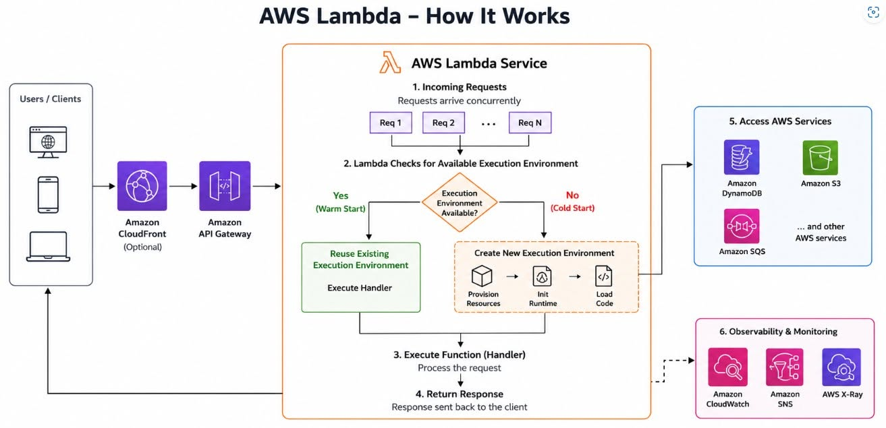
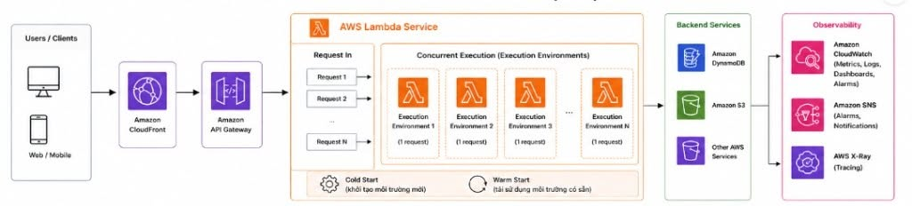

# Tìm hiểu chuyên sâu về AWS Lambda Concurrency

Trong quá trình phát triển dự án **AWS Event Management Platform**, mình có cơ hội làm việc khá nhiều với **AWS Lambda**. Ban đầu, mình nghĩ rằng khả năng mở rộng của Lambda đơn giản là "AWS sẽ tự động tạo thêm Lambda khi có nhiều request".

Sau khi đọc tài liệu chính thức của AWS và thực hành với các ứng dụng Serverless, mình nhận ra rằng phía sau cơ chế Auto Scaling là một mô hình thực thi phức tạp dựa trên **Execution Environment** và **Concurrency**.

Bài viết này tổng hợp những kiến thức mình tìm hiểu được về cách AWS Lambda xử lý hàng nghìn request đồng thời mà gần như không yêu cầu người phát triển phải quản lý máy chủ.

---

# AWS Lambda hoạt động như thế nào?

Hình dưới đây minh họa vòng đời của một request khi được gửi đến AWS Lambda.

Một request thông thường sẽ trải qua các bước sau:

1. Người dùng gửi request thông qua **Amazon CloudFront** (nếu có) và **Amazon API Gateway**.
2. AWS Lambda kiểm tra xem đã có **Execution Environment** sẵn sàng hay chưa.
3. Nếu đã có, Lambda sẽ tái sử dụng môi trường thực thi (**Warm Start**).
4. Nếu chưa có, Lambda sẽ tạo một **Execution Environment** mới (**Cold Start**), khởi tạo Runtime, nạp mã nguồn và bắt đầu thực thi.
5. Trong quá trình xử lý, Lambda có thể truy cập các dịch vụ AWS như **Amazon DynamoDB**, **Amazon S3** hoặc **Amazon SQS**.
6. Toàn bộ log, metric và trace sẽ được thu thập thông qua **Amazon CloudWatch** và **AWS X-Ray**.

---

# Lambda Concurrency là gì?

**Concurrency** là số lượng request mà AWS Lambda có thể xử lý **đồng thời tại cùng một thời điểm**.

Ví dụ, nếu một hàm Lambda mất khoảng 5 giây để hoàn thành và có 1.000 request được gửi gần như cùng lúc, Lambda sẽ cố gắng tạo nhiều **Execution Environment** để xử lý song song thay vì thực hiện tuần tự từng request.

Đây chính là cơ chế giúp Lambda có khả năng mở rộng tự động và trở thành một trong những dịch vụ cốt lõi của kiến trúc Serverless.

---

# Execution Environment

Một trong những khái niệm quan trọng nhất khi làm việc với AWS Lambda là **Execution Environment**.

Mỗi Execution Environment bao gồm:

- Runtime của Lambda
- CPU và bộ nhớ được cấp phát
- Mã nguồn của hàm Lambda
- Các thư viện và dependency đã được nạp

Khác với các máy chủ truyền thống, **mỗi Execution Environment chỉ xử lý một request tại một thời điểm**.

Khi số lượng request tăng lên, AWS sẽ tạo thêm nhiều Execution Environment mới thay vì để nhiều request cùng sử dụng chung một môi trường.

Hình dưới đây minh họa cách AWS Lambda phân phối các request đồng thời đến nhiều Execution Environment khác nhau.

Thiết kế này giúp cô lập các request với nhau, giảm nguy cơ chia sẻ trạng thái ngoài ý muốn và cho phép Lambda mở rộng theo chiều ngang mà không cần quản lý hạ tầng.

---

# Cold Start

**Cold Start** xảy ra khi AWS Lambda phải tạo mới hoàn toàn một Execution Environment.

Quá trình này bao gồm:

- Cấp phát tài nguyên tính toán.
- Khởi tạo Runtime.
- Nạp mã nguồn của Lambda.
- Khởi tạo các thư viện cần thiết.
- Thực thi hàm Handler.

Do phải trải qua toàn bộ các bước khởi tạo nên request đầu tiên thường có thời gian phản hồi cao hơn các request tiếp theo.

Đối với những Lambda có package lớn hoặc sử dụng nhiều thư viện, Cold Start có thể ảnh hưởng đáng kể đến hiệu năng của ứng dụng.

---

# Warm Start

Sau khi request đầu tiên hoàn thành, AWS thường giữ lại Execution Environment trong một khoảng thời gian.

Nếu có request mới đến trong khi môi trường này vẫn còn tồn tại, Lambda chỉ cần thực thi trực tiếp hàm Handler mà không phải khởi tạo lại Runtime hay nạp lại toàn bộ mã nguồn.

Cơ chế này được gọi là **Warm Start**.

Warm Start giúp giảm đáng kể thời gian phản hồi và cải thiện hiệu năng của các ứng dụng Serverless.

---

# Lambda mở rộng như thế nào?

Khác với Amazon EC2 Auto Scaling, AWS Lambda **không mở rộng dựa trên CPU hay RAM**.

Thay vào đó, Lambda mở rộng dựa trên **Concurrent Executions**.

Ví dụ:

| Số request đồng thời | Số Execution Environment |
|--------------------:|-------------------------:|
| 10 | Khoảng 10 |
| 100 | Khoảng 100 |
| 1000 | Khoảng 1000 (nếu chưa vượt giới hạn Concurrency) |

Khi lưu lượng tăng lên, AWS sẽ tự động tạo thêm Execution Environment mà không cần lập trình viên cấu hình Auto Scaling Group hoặc Load Balancer.

---

# Reserved Concurrency

Trong thực tế, không phải Lambda nào cũng có mức độ quan trọng như nhau.

Ví dụ:

- Xử lý thanh toán
- Xác thực người dùng
- Gửi email thông báo

Rõ ràng Lambda xử lý thanh toán cần được ưu tiên hơn chức năng gửi email.

AWS cung cấp tính năng **Reserved Concurrency** để dành riêng một phần tài nguyên Concurrency cho một Lambda cụ thể.

Nhờ đó, các Lambda quan trọng sẽ không bị ảnh hưởng nếu những Lambda khác sử dụng quá nhiều tài nguyên.

---

# Provisioned Concurrency

Mặc dù Warm Start giúp cải thiện hiệu năng, AWS không đảm bảo Execution Environment sẽ luôn tồn tại.

Đối với các hệ thống yêu cầu phản hồi gần như tức thì như:

- API thanh toán
- Dịch vụ xác thực
- Ứng dụng thời gian thực

AWS cung cấp **Provisioned Concurrency**.

Tính năng này giữ sẵn một số Execution Environment ở trạng thái đã khởi tạo hoàn chỉnh để sẵn sàng xử lý request ngay lập tức.

Ưu điểm:

- Giảm đáng kể Cold Start.
- Thời gian phản hồi ổn định.
- Cải thiện trải nghiệm người dùng.

Nhược điểm:

- Phát sinh thêm chi phí ngay cả khi không có request.

---

# Giám sát Lambda

**Amazon CloudWatch** đóng vai trò rất quan trọng trong việc theo dõi hiệu năng của Lambda.

Một số chỉ số cần quan tâm gồm:

- Concurrent Executions
- Invocations
- Duration
- Errors
- Throttles

Thông qua các chỉ số này, lập trình viên có thể phát hiện sớm các vấn đề về hiệu năng hoặc giới hạn Concurrency.

Nếu hệ thống thường xuyên đạt giới hạn Concurrency, có thể cân nhắc:

- Yêu cầu tăng Service Quota.
- Sử dụng Amazon SQS để xử lý bất đồng bộ.
- Cấu hình Reserved Concurrency.
- Sử dụng Provisioned Concurrency.

---

# Những điều mình học được

Trong quá trình tìm hiểu và triển khai AWS Lambda, mình rút ra một số kinh nghiệm khá hữu ích:

- Khởi tạo kết nối cơ sở dữ liệu bên ngoài Handler để tận dụng Warm Start.
- Giảm kích thước package nhằm hạn chế Cold Start.
- Sử dụng Lambda Layer để quản lý các thư viện dùng chung.
- Theo dõi CloudWatch thường xuyên để kiểm tra Duration, Errors, Concurrent Executions và Throttles.
- Với các ứng dụng chạy liên tục hoặc cần duy trì kết nối lâu dài, Amazon ECS hoặc Amazon EC2 sẽ phù hợp hơn AWS Lambda.

---

# Kết luận

AWS Lambda không chỉ đơn thuần là dịch vụ **"chạy code mà không cần quản lý máy chủ"**.

Sức mạnh thực sự của Lambda nằm ở cơ chế **Execution Environment**, khả năng mở rộng theo **Concurrency** cùng với việc cân bằng giữa **Cold Start** và **Warm Start**.

Việc hiểu rõ các khái niệm này sẽ giúp chúng ta thiết kế các ứng dụng Serverless có khả năng mở rộng tốt, tối ưu chi phí và đáp ứng hiệu quả khi lưu lượng truy cập tăng cao.

---

# Tài liệu tham khảo

- AWS Lambda Developer Guide
- AWS Lambda Concurrency Documentation
- https://docs.aws.amazon.com/lambda/latest/dg/lambda-concurrency.html
- https://docs.aws.amazon.com/lambda/latest/dg/welcome.html